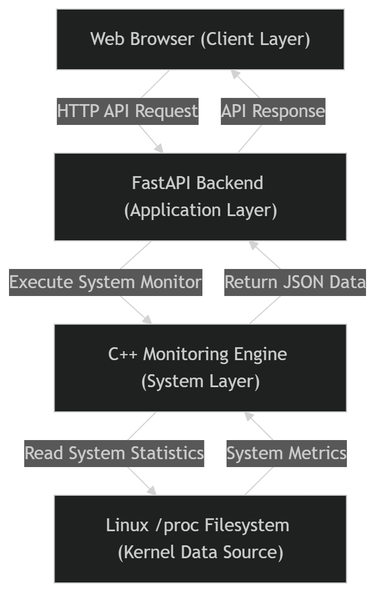
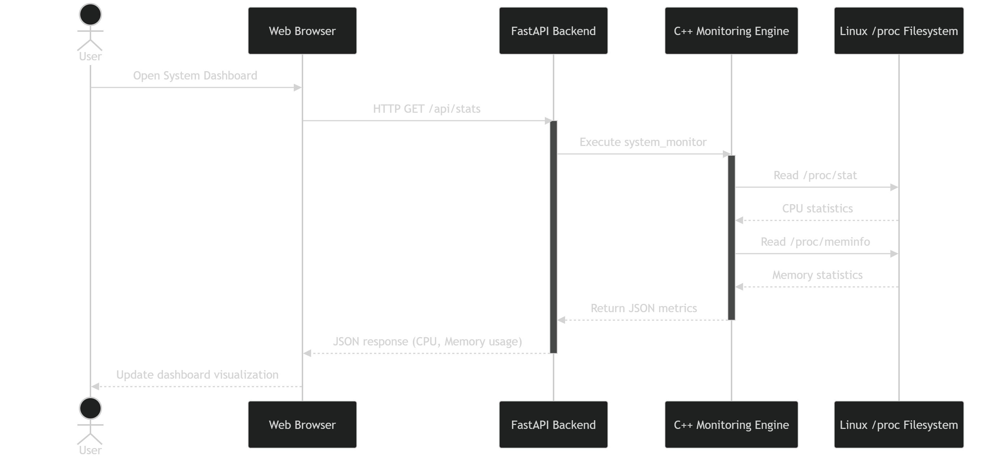
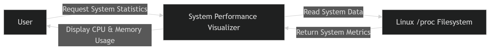
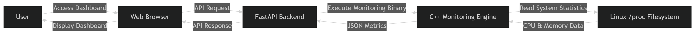
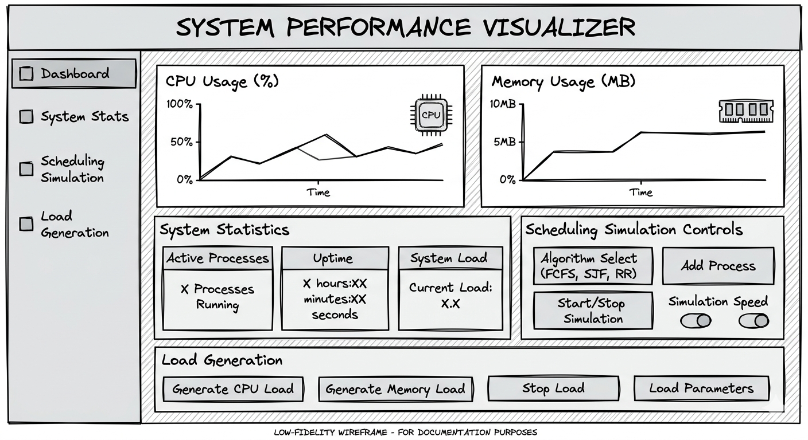

# System Performance Visualizer & CPU Scheduler Simulator

<p align="center">

A cloud-enabled system monitoring and operating system visualization project built with a C++ system engine and FastAPI backend.

</p>

<p align="center">


</p>

- [System Performance Visualizer \& CPU Scheduler Simulator](#system-performance-visualizer--cpu-scheduler-simulator)
  - [Description](#description)
  - [Quick Navigation](#quick-navigation)
  - [Features](#features)
  - [Technologies Used](#technologies-used)
  - [Development Environment](#development-environment)
  - [Using GitHub Codespaces](#using-github-codespaces)
    - [Steps](#steps)
    - [Running the Backend](#running-the-backend)
  - [Repository Structure](#repository-structure)
  - [Academic Context](#academic-context)
  - [Viva Preparation](#viva-preparation)
  - [Development Notes](#development-notes)
  - [Project Plan](#project-plan)
- [System Design Diagrams](#system-design-diagrams)
  - [Project Roadmap](#project-roadmap)
  - [Status](#status)


## Description

A cloud-enabled system performance visualization and CPU scheduling simulation project developed using C++ for the system engine and Python (FastAPI) for the web backend. The project is designed to demonstrate operating system concepts such as CPU scheduling and system resource monitoring through an accessible web-based interface.

The system reads real-time performance statistics from the Linux `/proc` filesystem and exposes them through a REST API for visualization.

## Quick Navigation

| Section                                             | Description                 |
| --------------------------------------------------- | --------------------------- |
| [Features](#features)                               | Project capabilities        |
| [Technologies Used](#technologies-used)             | Tools and frameworks        |
| [Development Environment](#development-environment) | Codespaces & Dev Containers |
| [Repository Structure](#repository-structure)       | Project organization        |
| [System Design Diagrams](#system-design-diagrams)   | Architecture and workflow   |
| [Viva Notes](docs/viva/README.md)                   | Viva preparation            |
| [Development Rules](docs/development/README.md)     | Coding and workflow rules   |
| [Plan of Action](docs/plan/planOfAction.md)         | Project development roadmap |

---

## Features

* CPU scheduling simulation (FCFS, SJF, Priority, Round Robin)
* Memory allocation visualization
* Real-time system performance monitoring
* REST API for system statistics
* Modular system monitoring engine written in C++

## Technologies Used

* C++ (system monitoring engine)
* Python (FastAPI backend)
* Uvicorn (ASGI server)
* Linux (`/proc` filesystem)
* HTML / CSS / JavaScript (planned frontend)

## Development Environment

The project uses a portable development environment based on **GitHub Codespaces** and **Dev Containers**.

This allows the project to be developed from any computer without installing local dependencies.

The dev container automatically installs:

* C++ build tools (g++)
* Python
* FastAPI dependencies
* Required VS Code extensions

When a Codespace starts, the environment is automatically prepared and the C++ monitoring engine is built using the project build script.

This ensures consistent development environments across multiple systems.

## Using GitHub Codespaces

The project can be developed directly in the browser using GitHub Codespaces.

### Steps

1. Open the repository on GitHub.
2. Click **Code**.
3. Select the **Codespaces** tab.
4. Click **Create Codespace on development**.

GitHub will automatically build the development container and install all dependencies.

Once the environment starts, the system monitor binary is built automatically.

### Running the Backend

```
cd backend
uvicorn app:app --host 0.0.0.0 --port 8000
```

The API endpoint can be accessed at:

```
/api/stats
```

## Repository Structure

The project follows a structured repository layout separating the system engine, backend services, documentation, and development infrastructure.

Typical structure:

```
system-performance-visualizer
│
├── src/                # C++ system monitoring engine
├── backend/            # FastAPI backend service
├── docs/               # Project documentation
│   ├── viva/           # Viva preparation notes
│   ├── development/    # Development rules and workflow
│   ├── plan/           # Plan of action
│   └── proposals/      # Architecture and design documents
├── scripts/            # Build and automation scripts
├── .devcontainer/      # Dev container configuration
├── README.md           # Project overview
└── .gitignore          # Git ignore rules
```

This structure ensures clear separation between the system engine, web backend, documentation, and development infrastructure.

## Academic Context

This project is developed as a Major Project for the Bachelor of Computer Applications (BCA) program under the Panjab University syllabus.

## Viva Preparation

All viva-related questions and answers are maintained here:

* [Viva Notes](docs/viva/README.md)

## Development Notes

Development rules and workflow are documented here:

* [Development Rules](docs/development/README.md)

## Project Plan

The detailed development roadmap is available here:

* [Plan of Action](docs/plan/planOfAction.md)

---

# System Design Diagrams

This section contains the major design diagrams used to describe the architecture and workflow of the **System Performance Visualizer**.

These diagrams explain how different components of the system interact and how data flows through the application.

---

<details>
<summary><strong>System Architecture Diagram</strong></summary>

<br>

The architecture diagram provides a high-level overview of the layered structure of the application.  
It shows how the **web client communicates with the FastAPI backend**, which then interacts with the **C++ monitoring engine** to retrieve system statistics from the Linux `/proc` filesystem.

Full source: [View Diagram Source](docs/diagrams/System_Architecture.md)

<p align="center">

</p>

</details>

---

<details>
<summary><strong>Sequence Diagram</strong></summary>

<br>

The sequence diagram illustrates the **runtime interaction between system components** when a user requests system statistics from the dashboard.

It shows how the browser sends a request to the backend API, the backend executes the monitoring engine, and the engine retrieves system metrics from the Linux kernel.

Full source: [View Diagram Source](docs/diagrams/Sequence_Diagram.md)

<p align="center">

</p>

</details>

---

<details>
<summary><strong>Data Flow Diagram (Level 0)</strong></summary>

<br>

The Level 0 Data Flow Diagram (DFD) represents the **entire system as a single process** interacting with external entities such as the user and the Linux kernel.

Full source: [View Diagram Source](docs/diagrams/Data_Flow_Diagram_Level_0.md)

<p align="center">

</p>

</details>

---

<details>
<summary><strong>Data Flow Diagram (Level 1)</strong></summary>

<br>

The Level 1 DFD expands the system into internal components such as the browser, backend API, monitoring engine, and kernel data source.

This diagram explains how **data flows through the system during a monitoring request**.

Full source: [View Diagram Source](docs/diagrams/Data_Flow_Diagram_Level_1.md)

<p align="center">

</p>

</details>

---

<details>
<summary><strong>GUI Design Diagram</strong></summary>

<br>

The GUI design diagram represents the planned layout of the web dashboard interface used to visualize system performance statistics.

It illustrates how CPU usage charts, memory statistics, and system controls will be arranged in the user interface.

<p align="center">

</p>

</details>

---

## Project Roadmap

The development of the **System Performance Visualizer** follows a structured multi-phase plan.  
Each phase represents a milestone in the implementation of the system.

| Phase    | Description                                                | Status        |
| -------- | ---------------------------------------------------------- | ------------- |
| Phase 1  | Project setup, repository structure, and development rules | ✅ Completed   |
| Phase 2  | Implementation of the C++ system monitoring engine         | ✅ Completed   |
| Phase 3  | System architecture and documentation design               | ✅ Completed   |
| Phase 4  | Web backend development using FastAPI                      | 🚧 In Progress |
| Phase 5  | Web dashboard frontend development                         | ⏳ Planned     |
| Phase 6  | CPU scheduling simulation module                           | ⏳ Planned     |
| Phase 7  | System load generation feature                             | ⏳ Planned     |
| Phase 8  | Cloud deployment on Linux server                           | ⏳ Planned     |
| Phase 9  | System testing and validation                              | ⏳ Planned     |
| Phase 10 | Final documentation and project submission                 | ⏳ Planned     |

The complete development plan can be viewed here:

➡ [Project Plan of Action](docs/plan/planOfAction.md)

---

## Status

🚧 In development
