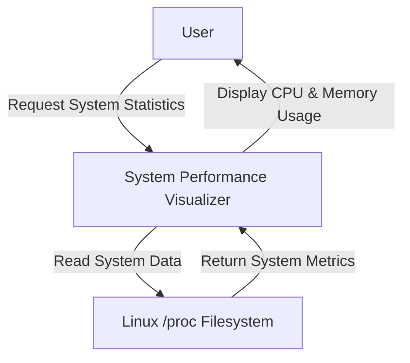

```mermaid
flowchart TB
    User["User"] -- Request System Statistics --> System["System Performance Visualizer"]
    System -- Display CPU & Memory Usage --> User
    System -- Read System Data --> Kernel["Linux /proc Filesystem"]
    Kernel -- Return System Metrics --> System
```
