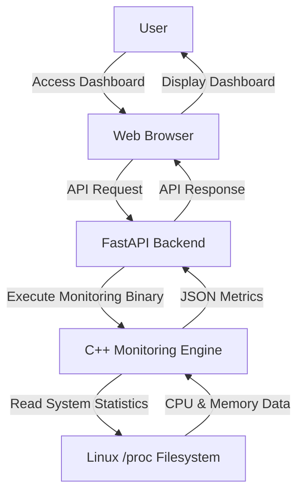

```mermaid
flowchart TB
    User["User"] -- Access Dashboard --> Browser["Web Browser"]
    Browser -- API Request --> Backend["FastAPI Backend"]
    Backend -- Execute Monitoring Binary --> Engine["C++ Monitoring Engine"]
    Engine -- Read System Statistics --> Kernel["Linux /proc Filesystem"]
    Kernel -- CPU & Memory Data --> Engine
    Engine -- JSON Metrics --> Backend
    Backend -- API Response --> Browser
    Browser -- Display Dashboard --> User
```
