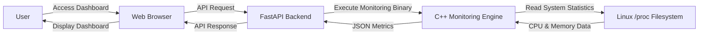

```mermaid
flowchart LR

    User["User"]
    Browser["Web Browser"]
    Backend["FastAPI Backend"]
    Engine["C++ Monitoring Engine"]
    Kernel["Linux /proc Filesystem"]

    User -->|Access Dashboard| Browser
    Browser -->|API Request| Backend
    Backend -->|Execute Monitoring Binary| Engine
    Engine -->|Read System Statistics| Kernel
    Kernel -->|CPU & Memory Data| Engine
    Engine -->|JSON Metrics| Backend
    Backend -->|API Response| Browser
    Browser -->|Display Dashboard| User
```
