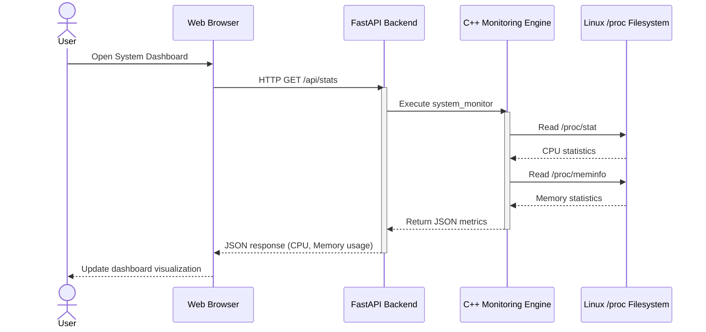

```mermaid
sequenceDiagram

actor User
participant Browser as Web Browser
participant API as FastAPI Backend
participant Engine as C++ Monitoring Engine
participant Kernel as Linux /proc Filesystem

User ->> Browser: Open System Dashboard
Browser ->> API: HTTP GET /api/stats

activate API
API ->> Engine: Execute system_monitor
activate Engine

Engine ->> Kernel: Read /proc/stat
Kernel -->> Engine: CPU statistics

Engine ->> Kernel: Read /proc/meminfo
Kernel -->> Engine: Memory statistics

Engine -->> API: Return JSON metrics
deactivate Engine

API -->> Browser: JSON response (CPU, Memory usage)
deactivate API

Browser -->> User: Update dashboard visualization
```
