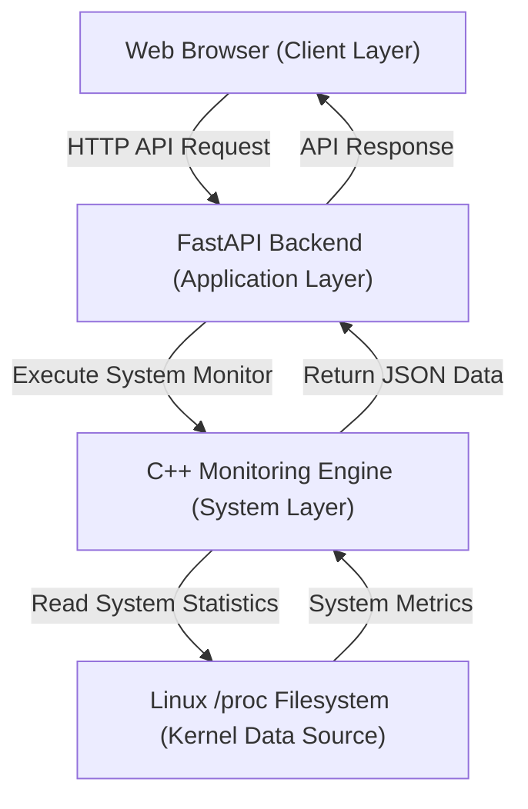

```mermaid
flowchart TD

    A["Web Browser (Client Layer)"]
    B["FastAPI Backend (Application Layer)"]
    C["C++ Monitoring Engine (System Layer)"]
    D["Linux /proc Filesystem (Kernel Data Source)"]

    A -->|HTTP API Request| B
    B -->|Execute System Monitor| C
    C -->|Read System Statistics| D
    D -->|System Metrics| C
    C -->|Return JSON Data| B
    B -->|API Response| A

```
