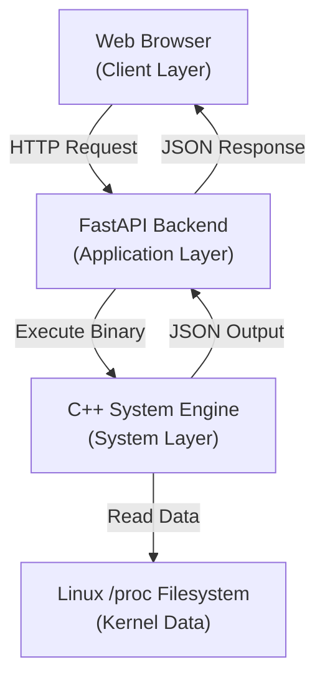

```mermaid
flowchart TD
    A["Web Browser<br>(Client Layer)"]
    B["FastAPI Backend<br>(Application Layer)"]
    C["C++ System Engine<br>(System Layer)"]
    D["Linux /proc Filesystem<br>(Kernel Data)"]

    A -->|HTTP Request| B
    B -->|Execute Binary| C
    C -->|Read Data| D
    C -->|JSON Output| B
    B -->|JSON Response| A
```